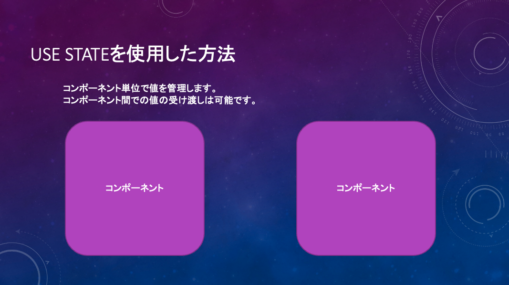
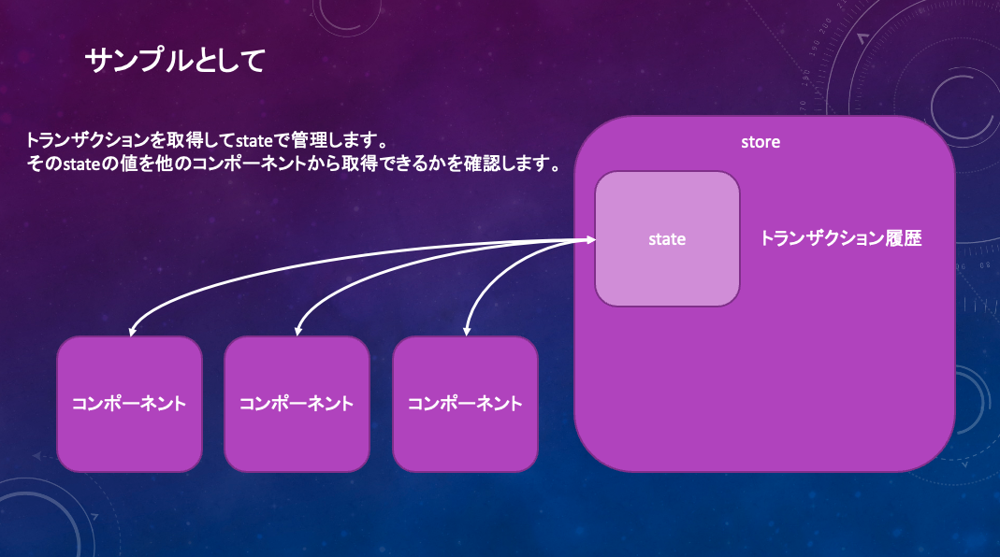
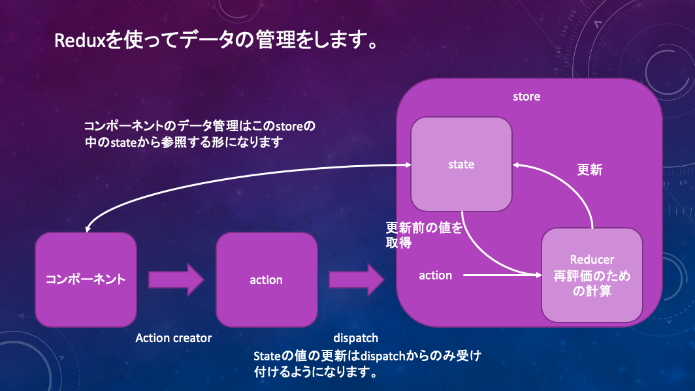

# このブランチではReduxを使用した状態管理を実施します

mainブランチではuseStateを使用した状態管理を実施しました。

注）状態管理と表現していますが、これはstate managementの意味になります。
stateを訳すと状態となります。このstateでは文字列の変数や数字の変数、配列の変数、再評価の関数処理など結構幅広く管理できるので状態管理と訳すと最初は
困惑すると思います。まずは変数管理と思うのがいいかと思います。

<!-- markdownlint-disable MD033 -->
<!-- markdownlint-disable MD012 -->
<!-- markdownlint-disable MD047 -->

## Reduxを使った状態管理サンプルその1

トランザクション履歴をstateで管理して

そのstateの値を各コンポーネントで参照することができるかを確認します。

注意）Reduxについて
先ほどお伝えした状態管理を実施する方法です。

イメージ図はこちらです。

ルールとしては

stateの値の変更は

dispatch経由のactionのみになります。

値の取得はuseSelectorを使用します